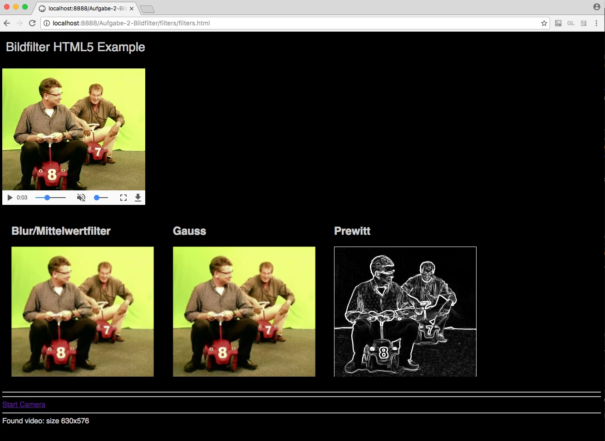
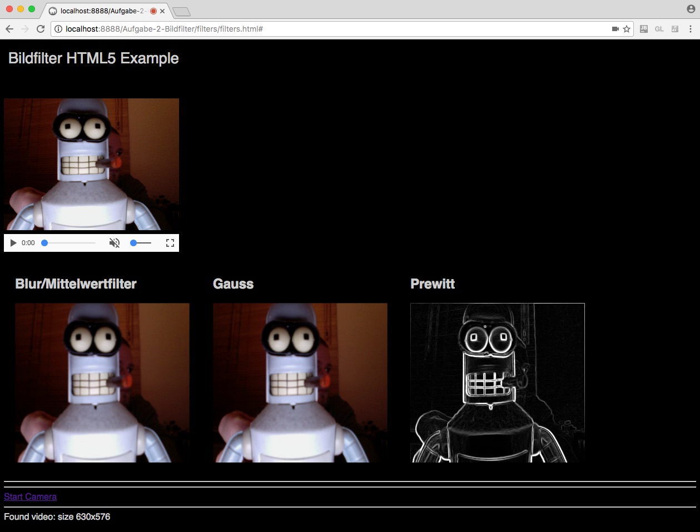

# MMP WS2016 / 2017 - Video Übung 2

- Robin Mehlitz (857946)
- Tom Oberhauser (859851)

## Screenshots





## Implementierung

Als technische Grundlage zur Realisierung dieser Aufgabe wurden die Techniken aus der ersten Aufgabe, speziell aus der Chroma Key Teilaufgabe verwendet.
Zur Anwendung eines Faltungsfilters wurden Helfermethoden zum direkten Zugriff auf die RGB Werte an einer gegebenen Koordinate `getPixelRGB()`, sowie eine Methode zur Berechnung einer gewichteten Summe aus einem Werte- und einem Gewichts-Array (`applyFilter()`) implementiert.

#### `getPixelRGB()`

```javascript
// Returns an [r,g,b] array for a given coordinate out of a frame
// if x or y is outside the image, it returns [0,0,0]
getPixelRGB: function(frame, x, y) {
    if (x < 0 || x > frame.width || y < 0 || y > frame.height) {
        return [0,0,0];
    }
    i = y * frame.width + x;
    var r = frame.data[i * 4 + 0];
    var g = frame.data[i * 4 + 1];
    var b = frame.data[i * 4 + 2];
    return [r,g,b];
}
```

#### `applyFilter()`

```javascript
// applies weights to values and returns a sum scalar
// values = [2,5,7], weights = [1,2,0] => 12
applyFilter: function(values, weights) {
    sum = 0;
    for (var i = 0; i < values.length; i++) {
        sum += values[i] * weights[i];
    }
    return sum;
}
```

### Anwendung der Filter

Alle, zur Anwendung eines 3x3 Faltungsfilter, benötigten Farbwerte werden mit den genannten Helfermethoden ausgelesen und in ein Array zur Weiterverarbeitung überführt.

```javascript
// ...
var x = i % frame.width;
var y = Math.floor(i / frame.width);
var r_1 = this.getPixelRGB(frame, x - 1, y - 1)[0];
var r_2 = this.getPixelRGB(frame, x    , y - 1)[0];
// ...
var b_8 = this.getPixelRGB(frame, x    , y + 1)[2];
var b_9 = this.getPixelRGB(frame, x + 1, y + 1)[2];

var red_matrix = [
    r_1, r_2, r_3,
    r_4, r_i, r_6,
    r_7, r_8, r_9
];
// ...
var grayscale_matrix = [
    0.3*r_1+0.59*g_1+0.11*b_1, 0.3*r_2+0.59*g_2+0.11*b_2, 0.3*r_3+0.59*g_3+0.11*b_3,
    0.3*r_4+0.59*g_4+0.11*b_4, 0.3*r_i+0.59*g_i+0.11*b_i, 0.3*r_6+0.59*g_6+0.11*b_6,
    0.3*r_7+0.59*g_7+0.11*b_7, 0.3*r_8+0.59*g_8+0.11*b_8, 0.3*r_9+0.59*g_9+0.11*b_9,
];
```

#### Anwendung des Median-Filter

```javascript
var median_filter = [
    1/9, 1/9, 1/9,
    1/9, 1/9, 1/9,
    1/9, 1/9, 1/9
];
// ...
frame_blur.data[i*4+0] = this.applyFilter(red_matrix, median_filter);
frame_blur.data[i*4+1] = this.applyFilter(green_matrix, median_filter);
frame_blur.data[i*4+2] = this.applyFilter(blue_matrix, median_filter);
// ...
this.ctx1.putImageData(frame_blur, 0, 0);
```
#### Gauß-Filter

Der 3x3 Filterkern für den Gauß-Filter wurde mithilfe von [http://dev.theomader.com/gaussian-kernel-calculator/](http://dev.theomader.com/gaussian-kernel-calculator/) erstellt.

```javascript
var gauss_filter = [
    0.077847,	0.123317,	0.077847,
    0.123317,	0.195346,	0.123317,
    0.077847,	0.123317,	0.077847,
];
// ...
frame_gauss.data[i*4+0] = this.applyFilter(red_matrix, gauss_filter);
frame_gauss.data[i*4+1] = this.applyFilter(green_matrix, gauss_filter);
frame_gauss.data[i*4+2] = this.applyFilter(blue_matrix, gauss_filter);
// ...
this.ctx2.putImageData(frame_gauss, 0, 0);
```

#### Prewitt-Filter

Der Prewitt-Filter besteht aus zwei separaten Filterkernen: Einen für die X-, und Einen für die Y-Achse.
Die 3x3 Filterkerne wurden der [Wikipedia](https://de.wikipedia.org/wiki/Prewitt-Operator) entnommen.
Im Gegensatz zu den anderen Filtern wird dieser auf ein Graustufenbild angewendet.
Die beiden Ergebnisse werden anschließend verrechnet und bilden das finale Bild.

```javascript
var prewittX_filter = [
    -1, 0, 1,
    -1, 0, 1,
    -1, 0, 1
];
var prewittY_filter = [
    -1, -1, -1,
     0,  0,  0,
     1,  1,  1
];
// ...
var prewitt_X = this.applyFilter(grayscale_matrix, prewittX_filter);
var prewitt_Y = this.applyFilter(grayscale_matrix, prewittY_filter);
var prewitt = Math.sqrt(prewitt_X * prewitt_X + prewitt_Y * prewitt_Y);
frame_prewitt.data[i*4+0] = prewitt;
frame_prewitt.data[i*4+1] = prewitt;
frame_prewitt.data[i*4+2] = prewitt;
// ...
this.ctx3.putImageData(frame_prewitt, 0, 0);
```
